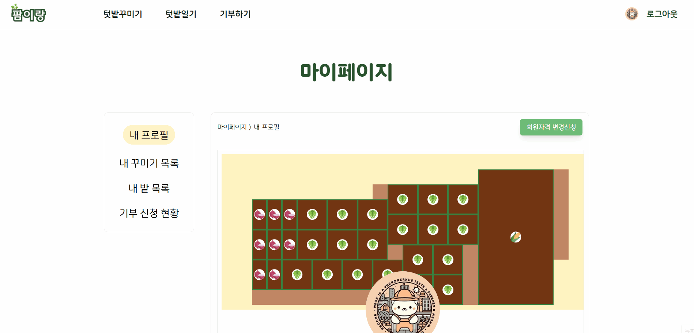
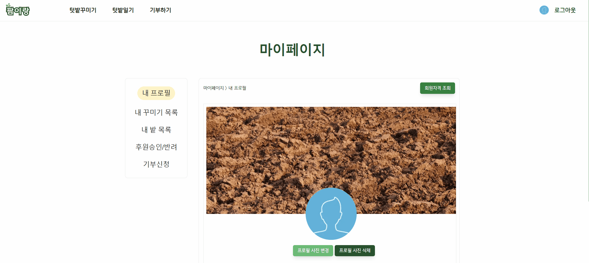

# 🌱 도시농부를 위한 농업 올인원 패키지 서비스, 팜이랑

## 목차

- [📌 서비스 소개](#-서비스-소개)
- [⏱ 개발 기간](#-개발-기간)
- [👥 팀 소개](#-팀-소개)
- [🛠️ 기술 스택](#️-기술-스택)
- [💡 주요 기능](#-주요-기능)
- [🌐 포팅 매뉴얼](#-포팅-매뉴얼)
- [💻 서비스 화면](#-서비스-화면)
- [📄 설계 문서](#-설계-문서)

### 📌 서비스 소개

##### 나만의 텃밭 꾸미기

- 텃밭을 그리면 맞춤형 텃밭 디자인 제공은 물론, 원하는 텃밭 디자인으로 커스텀도 할 수 있습니다.

##### 자동으로 기록되는 텃밭일기로 체계적인 텃밭 관리

- IoT 기기로 텃밭 상태를 자동으로 기록하고, 수동으로 필요한 내용을 기록해서 텃밭 관리를 할 수 있습니다.

##### 수확의 기쁨 나누기

- 간편한 작물 기부 시스템을 통해 수확의 기쁨을 나눌 수 있습니다.

### ⏱ 개발 기간

- 2024.04.08 ~ 2024.05.20 (7주)

### 👥 팀 소개

<table align="center">
  <tr>
    <tr align="center">
        <td style="min-width: 250px;">
            <a href="https://github.com/KuMMii">
              <b>김지은</b>
            </a>
        </td>
        <td style="min-width: 250px;">
            <a href="https://github.com/hyeonjong-kim">
              <b>김현종</b>
            </a>
        </td>
        <td style="min-width: 250px;">
            <a href="https://github.com/dig04214">
              <b>이병창</b>
            </a> 
        </td>
    </tr>
    <tr align="center">
        <td style="min-width: 250px;">
              
        </td>
        <td style="min-width: 250px;">
              
        </td>
        <td style="min-width: 250px;">
              
        </td>
    </tr>
    <tr align="center">
        <td>
        <b>Team Leader, Backend</b> 텃밭꾸미기 API 
채팅 API 
        </td>
        <td>
        <b>Infrastructure, Backend, IoT</b> 텃밭 일지 API 텃밭 API 
        </td>
        <td>
        <b>Backend</b> 소셜로그인 회원 API 기관 API 기부 API 운영자 API
        </td>
    </tr>
  </tr>
  <tr>
    <tr align="center">
        <td style="min-width: 250px;">
            <a href="https://github.com/printilikepenguin">
              <b>김현지</b>
            </a>
        </td>
        <td style="min-width: 250px;">
            <a href="https://github.com/Hocheol18">
              <b>박호철</b>
            </a>
        </td>
        <td style="min-width: 250px;">
            <a href="https://github.com/JHyeon-a">
              <b>정현아</b>
            </a> 
        </td>
    </tr>
    <tr align="center">
        <td style="min-width: 250px;">
              
        </td>
        <td style="min-width: 250px;">
              
        </td>
        <td style="min-width: 250px;">
              
        </td>
    </tr>
    <tr align="center">
        <td>
        <b>Frontend</b> 유저/운영자 
        상태관리
        </td>
        <td>
        <b>Frontend</b> 텃밭 일기 기부하기 마이페이지 내 밭 목록
        </td>
        <td>
        <b>Frontend</b> 텃밭꾸미기 
        마이페이지-꾸미기 목록
        </td>
    </tr>
  </tr>

</table>

### 🛠️ 기술 스택

##### 📱 Frontend

##### 💻 Backend

 
 

##### 🔧 IoT

##### 🚀 Infrastructure

##### ⚙️ Management Tools

##### 🖥️ IDE

### 💡 주요 기능

#### 1. 맞춤형 텃밭 디자인 추천 및 텃밭 디자인 기록

- 좌표평면에서 사용자가 직접 텃밭의 모양을 설정할 수 있습니다.
- 사용자가 원하는 작물과 수량, 우선순위를 선택하면 맞춤형 텃밭 디자인을 추천합니다.
- 커스텀 디자인 기능을 통해 자신만의 독특한 텃밭을 설계할 수 있습니다.

#### 2. IoT를 이용한 자동 텃밭일기 기록

- IoT 기기를 통해 온습도와 토양습도를 자동으로 측정하고, 이를 바탕으로 작물의 상태를 매일 일기에 기록합니다.
- 자동으로 기록된 일기 외에도 수동으로 텃밭일기에 원하는 내용을 추가할 수 있습니다.

#### 3. 기부 커뮤니티

- 기관의 기부 요청글에 응답하여 사용자가 자신의 작물을 기부할 수 있습니다.
- 사용자는 기부 횟수와 확인할 수 있습니다.

### 🌐 포팅 매뉴얼

[포팅 매뉴얼 보러가기](https://lab.ssafy.com/s10-final/S10P31A105/-/blob/master/exec/%ED%8F%AC%ED%8C%85%EB%A9%94%EB%89%B4%EC%96%BC.md?ref_type=heads)

### 💻 서비스 화면

#### [메인 페이지]

#### [로그인]

- 카카오톡, 구글 로그인 가능

#### [텃밭꾸미기 페이지]

##### 텃밭꾸미기 가이드라인 확인

##### 텃밭 모양과 정보 입력

##### 작물 선택 후 디자인 추천 받기

##### 텃밭 커스텀

##### 비료 추천

- [1단계] 가이드라인 확인
- [1단계] 사용자가 좌표를 찍어 원하는 모양 생성 후 전체 넓이, 두둑과 고랑 너비, 이랑의 방향, 그리고 작물 심는 시기를 입력 후 텃밭 생성
- [2단계] 작물 심는 시기에 맞게 작물 리스트 정렬
- [2단계] "추천 받기" 클릭 시 두둑 크기에 맞는 원하는 작물 선택 후, 두둑의 넓이에 맞게 수량 입력, 우선 순위 입력 후 추천 받기
- [3단계] "커스텀하기" 클릭 시 작물 리스트에서 원하는 작물 선택 후, 우측의 밭의 셀 클릭 후 저장
- [4단계] 텃밭에 심은 작물 별 비료 추천받기

#### [텃밭일기 페이지]

##### 밭 등록

##### 텃밭일기 작성

- 생성한 디자인 중 하나로 밭 등록
- IoT로 대기 온습도와 토양 습도 데이터를 받아 자동으로 일일 일기 생성
- 데이터를 기반으로 심은 작물의 상태 조회
- 수동으로 일지 작성 가능

#### [기부하기 페이지]

##### 모금 중인 기부 및 기부 상세페이지

- 모금 중인 기부 조회
- 각 기부 목록에 대한 상세 조회 가능
- 기부 글 내용 및 후원 목록 조회 가능

- 기부 가능한 작물 선택 후 후원
- 기부 작물 선택 및 작물 갯수 입력
- 작물을 보냈다는 것을 확인하기 위한 인증샷 첨부

#### [마이페이지]

##### 프로필 - 일반

##### 회원자격 변경 신청 - 일반

##### 프로필 - 단체/기관

##### 꾸미기 목록 - 공통

##### 꾸미기 상세 - 공통

##### 밭 목록 - 공통

##### 기부 신청 현황 - 일반

##### 후원 승인/반려 - 단체/기관

##### 기부 신청 - 단체/기관

- [내 프로필] 대표 디자인, 프로필 사진, 닉네임, 회원자격(일반|단체/기관), 기부횟수 조회
- [내 프로필] 일반회원은 회원자격 변경신청
- [내 꾸미기 목록] 대표 디자인, 디자인 생성 날짜 내림차순으로 정렬
- [내 꾸미기 목록] 디자인 상세 조회 및 대표 디자인 설정
- [내 밭 목록] 등록한 밭 확인 및 삭제
- [기부 신청 현황] 후원 목록 확인
- [후원 승인/반려] 후원 신청이 들어온 요청 승인/반려
- [기부 신청] 신청폼 작성 후 신청

#### [관리자 페이지]

##### 단체/기관 승인

- 단체/기관의 유저 권한 변경 승인

### 📄 설계 문서

#### 1. ERD

#### 2. 아키텍처

#### [3. Mockup](https://www.figma.com/design/WBCjXPvsvZZfc2xUbjAPoz/%ED%8C%9C%EC%9D%B4%EB%9E%91?node-id=66%3A6&t=XYHRPETKxnpJrTWk-1)

#### [4. 기능 명세서](https://dig04214.notion.site/c60e3f1def934b31bcbd66fb6381c464?pvs=4)

#### 5. API 명세서

- [Member API](http://k10a105.p.ssafy.io:8081/api/swagger-ui/index.html#/)
- [Agency API](http://k10a105.p.ssafy.io:8083/api/swagger-ui/index.html#/)
- [Field & Recommend API](http://k10a105.p.ssafy.io:8083/api/swagger-ui/index.html#/)
- [Diary API](http://k10a105.p.ssafy.io:8082/swagger-ui/index.html#/)
- [Design API](http://k10a105.p.ssafy.io:8084/swagger-ui/index.html#/)
- [Donation API](http://k10a105.p.ssafy.io:8085/swagger-ui/index.html#/)
- [Chat API](http://k10a105.p.ssafy.io:8086/swagger-ui/index.html)
